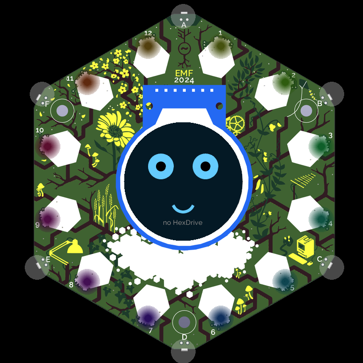

# Hexling

A robot pet for the EMF Tildagon badge. The hexling lives on the round
screen — it gets hungry, bored and sleepy, and you feed, stroke and play
with it to keep it happy. With a [BadgeBot / HexDrive
hexpansion](https://github.com/TeamRobotmad/BadgeBot) fitted it also has
a body: happy hexlings wiggle, bored ones look around, hungry ones
shuffle at you. Any HexDrive variant works (2 motor, 4 servo,
1 motor + 2 servo); the app detects what is fitted and ignores channels
it doesn't have. Without a HexDrive the pet still runs, body offline.

## Controls

| Spaceagon (2026)          | 2024 frontboard | Effect                      |
| ------------------------- | --------------- | --------------------------- |
| Joystick fire / C         | C (confirm)     | Feed                        |
| Joystick directions       | A / B / D / E   | Play (nudges trigger moves) |
| Touch strip (stroke it!)  | —               | Pet the hexling             |
| Proximity sensors         | —               | Wake it up                  |
| F                         | F (cancel)      | Minimise (pet keeps living) |

## Layout

- `app.py` — badge glue: lifecycle, input, HexDrive wiring (`HexlingApp`)
- `pet.py` — the brain: needs, moods, behaviour (pure Python, tested headless)
- `moves.py` — scripted body moves + `MoveRunner` (pure Python)
- `hexdrive.py` — HexDrive detection and slew-limited motor/servo control
- `face.py` — everything drawn on the screen
- `tests/` — headless pytest suite (no simulator or hardware needed)
- `tools/` — dev helpers (headless sim screenshots)

Working on this with an AI agent? [AGENTS.md](AGENTS.md) holds the
context that isn't discoverable from the code.

## Commands

- `make test` — run the headless test suite
- `make venv` — one-time env for sim/deploy (uses [uv](https://docs.astral.sh/uv/))
- `make sim` — run in the official badge simulator (symlinks this repo
  into `$(SIM_DIR)/sim/apps`; override `SIM_DIR` if your
  [badge-2024-software](https://github.com/emfcamp/badge-2024-software)
  checkout lives elsewhere)
- `make sim-shot [SHOT_FRAMES=n]` — headless sim screenshot, refreshes
  `sim-shot.png` (default frame count skips the OS boot splash)
- `make deploy` — copy the app onto a USB-connected badge via mpremote

## Publishing

Per the [official docs](https://tildagon.badge.emfcamp.org/tildagon-apps/publish/):
push to GitHub/Codeberg, add the `tildagon-app` repo topic, and create a
`v0.0.1` release. Dev-only files (tests, Makefile, README) are excluded
from the badge download via `.gitattributes` export-ignore. Bump
`version` in `tildagon.toml` for each new release.

## TODO / next steps

- Persist the pet's needs across restarts (`settings` with a
  `hexling.` prefix, or a small JSON file in the app dir)
- Mood on the LED ring (needs `PatternDisable` on entry / restore on exit)
- More moves, and personality (use IMU: react to being picked up/shaken)
- Battery awareness: idle the HexDrive boost converter when unused
- Hardware bring-up: check motor directions match the move scripts on a
  real BadgeBot chassis (swap signs in `moves.py` if it wiggles backwards)
